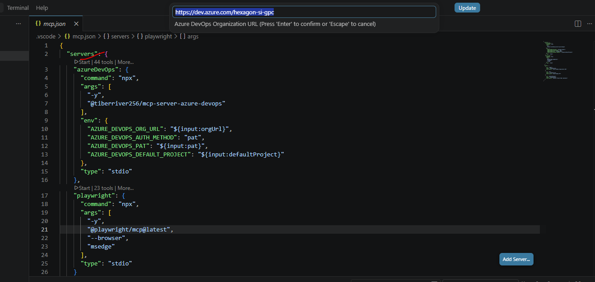
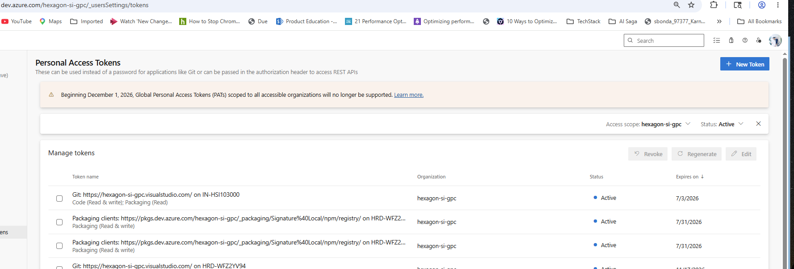

# Shared MCP Configuration

This repository shares a ready-to-use MCP setup for VS Code.

## Included

- `.vscode/mcp.json`
  - Azure DevOps MCP server

## Quick Start (New System)

1. Install Node.js (LTS)
2. Install Visual Studio Code
3. Install GitHub Copilot extension in VS Code
4. Clone this repository
5. Open the repository folder in VS Code
6. Click on **Start** button in the Copilot Chat panel
7. When prompted, enter the required information:

### Setup Prompts

When you click **Start**, VS Code will prompt you for the following:


*MCP configuration prompts in VS Code*

#### Azure DevOps Organization URL
```
https://dev.azure.com/hexagon-si-gpc
```
This is your organization's Azure DevOps base URL.

#### Azure DevOps PAT (Personal Access Token)
1. Navigate to https://dev.azure.com/hexagon-si-gpc/_usersSettings/tokens
2. Create a new token with **Full access** scope
3. Copy the token immediately
4. Paste the token when prompted in VS Code


*Personal Access Tokens page at https://dev.azure.com/hexagon-si-gpc/_usersSettings/tokens*

#### Default Project Name
```
Dispatch
```
This is the default project for Azure DevOps operations.

### Automatic Server Detection

VS Code will detect `.vscode/mcp.json` automatically and start the Azure DevOps MCP server for interacting with your Azure DevOps organization.

## Notes

- The config does not hardcode secrets for security
- PAT and organization URL are provided at runtime through input prompts
- Each time you open the workspace, you'll be prompted for the credentials
- **Important**: When creating a PAT token, ensure you select **Full access** scope to enable all Azure DevOps operations
- Save your PAT token securely - you cannot retrieve it again after creation

## Troubleshooting

### Azure DevOps Connection Issues
- Verify the Organization URL format: `https://dev.azure.com/<organization-name>`
- Ensure your PAT token has **Full access** scope
- Confirm the token hasn't expired by checking https://dev.azure.com/hexagon-si-gpc/_usersSettings/tokens
- If prompts appear empty, close the terminal and click **Start** again
